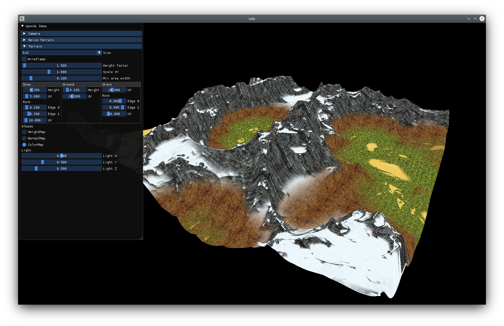

# odo


**O**penGL **d**em**o** project is used to discover modern:
* Toolchain
* C++
* OpenGL



## Terrain rendering features
* Instances of patches, with position & offset from vertex shader
* Camera based LOD, using GPU tessellation
* Procedural height from GPU combined noise functions

## Librairies
* [glfw](https://github.com/glfw/glfw/)/3.3.2
* [glad](https://github.com/Dav1dde/glad/)/0.1.33
* [glm](https://github.com/g-truc/glm/)/0.9.9.8
* [spdlog](https://github.com/gabime/spdlog/)/1.7.0
* [imgui](https://github.com/ocornut/imgui/)/1.79

## Installation

**Prerequisites:** 
* dependencies: pkg-config xorg-dev libx11-xcb-dev libxcb-render0-dev libxcb-render-util0-dev libxcb-xkb-dev libxcb-icccm4-dev libxcb-image0-dev libxcb-keysyms1-dev libxcb-randr0-dev libxcb-shape0-dev libxcb-sync-dev libxcb-xfixes0-dev libxcb-xinerama0-dev libxcb-dri3-dev libxcb-util-dev
* build system generator: [cmake](https://cmake.org/)
* build system: [ninja](https://ninja-build.org/)
* compiler: [clang++](https://clang.llvm.org/)
* package manager: [conan](https://conan.io/)

### Download packages

```bash
conan install . -if build/ -s build_type=Debug -s compiler=clang -s compiler.version=10 -s compiler.libcxx=libstdc++11 -e CC=clang -e CXX=clang++ -b outdated
```

#### Alternative

```bash
sh setup.sh
````

### Generate build files

```bash
CC=clang CXX=clang++ cmake -G Ninja -S . -B build/
```

#### Alternative

```bash
sh configure.sh
````

### Build

```bash
cmake --build build
```

#### Alternative

```bash
sh build.sh
````

## Usage

```bash
./build/bin/demo
````

#### Alternative

```bash
sh run
````

## Resources

### Textures
* Textures of Stunt Rally 2.3 from [opengameart.org](https://opengameart.org/content/terrain-textures-pack-from-stunt-rally-23)
